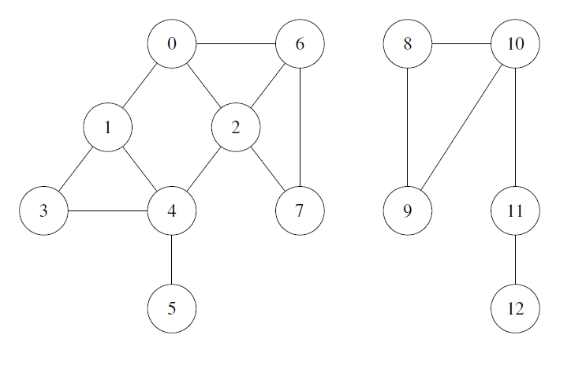

### Technische Universitat Wien
Institut fur Computergraphik und Algorithmen
Algorithms and Complexity Group

Connected graph with critical nodes implementation using [Tarjan's Algorithm](https://en.wikipedia.org/wiki/Tarjan%27s_strongly_connected_components_algorithm) for the exercise project in Java 8 in 186.813 Algorithmen und Datenstrukturen 1 VU, Sommersemester 2016. 
This implementation can determine:
- The number of nodes in the graph.
- The number of connections in the graph.
- The number of components in a graph.
- Whether a graph has a cycle.
- The shortest path between two nodes.
- The critical nodes in a graph (articulation points).

---

### Aufgabenstellung (German only)

Das Netzwerk wird vereinfacht als Sammlung von Netzwerkknoten und den Verbindungen
zwischen diesen Netzwerkknoten gesehen. Dabei gilt:

- Es wird am Anfang jedes Tests einer Instanz die Anzahl n der Knoten festgelegt. Diese Anzahl bleibt immer gleich, d.h. es werden keine neuen Knoten hinzugefügt bzw. geloscht. Es wird angenommen, dass n > 0 ist.
- Die Netzwerkknoten werden von 0 beginnend bis n−1 durchnummeriert.
- Zwischen zwei Netzwerkknoten kann eine Verbindung bestehen, uber die Daten ausgetauscht werden. Die Daten konnen in beide Richtungen fließen. Für die Lösung der
    Aufgaben ist die Richtung nicht von Bedeutung.
- Ein Knoten hat keine Verbindung zu sich selbst (Schleife).
- Die erwarteten Netzwerke sind dünn besetzt.

Ihre Aufgabe besteht aus zwei Teilen. Einerseits mussen Sie eine passende Datenstruktur für das Speichern der Daten implementieren. Andererseits müssen Sie folgende Operationen auf dieser Datenstruktur unterstützen: 
- int numberOfNodes(): Liefert die Anzahl der Knoten zurück.
- int numberOfConnections(): Liefert die Anzahl der Verbindungen zurück.
- void addConnection(int v, int w): Fügt eine Verbindung im Netzwerk zwischen den Knotenvundwein. Ist diese Verbindung schon vorhanden, dann passiert nichts, d.h. die Verbindung bleibt im Netzwerk erhalten.

- void addAllConnections(int v): Fügt Verbindungen von einem bestimmten
    Knoten v zu allen anderen Knoten ein. Hatte der Knoten schon Verbindungen, dann
    bleiben diese erhalten.
- void deleteConnection(int v, int w): Entfernt eine Verbindung zwischen
    den Knotenvundwaus dem Netzwerk. Ist die Verbindung nicht vorhanden, dann
    passiert nichts.
- void deleteAllConnections(int v): Entfernt alle Verbindungen für einen
    bestimmten Knotenvaus dem Netzwerk. Hatte der Knoten noch keine Verbindungen,
    dann passiert nichts.
- int numberOfComponents(): Liefert die Anzahl der Zusammenhangskomponenten im Netzwerk zurück.
- boolean hasCycle():Uberprüft, ob das Netzwerk einen Kreis enthält. Wenn dies
    der Fall ist, wirdtruezuruckgeliefert, ansonsten ̈false.
- int minimalNumberOfConnections(int start, int end): Liefert die
    kleinste Anzahl an Verbindungen, die durchlaufen werden muss, um von einem
    Startknotenstartzu einem Endknotenendzu gelangen. Sindstartundend
    gleich, dann soll 0 zuruckgeliefert werden. Sind startundendnichtuber einen
    Pfad miteinander verbunden, dann wird -1 zuruckgeliefert.
- List\<Integer\> criticalNodes(): Liefert eine Liste jener Knoten zurück, die
    als kritisch eingestuft werden. Ein Knoten ist kritisch, wenn das Entfernen aller
    Verbindungen zu diesem Knoten nicht nur diesen Knoten isoliert, sondern auch seine
    ursprüngliche Zusammenhangskomponente in drei oder mehr Zusammenhangskom-
    ponenten zerfallen lässt.

Bitte beachten Sie noch folgende Hinweise zur Implementierung:

- Sie dürfen für die Datenhaltung (Speicherung der Knoten und Verbindungen) Java-Datenstrukturen verwenden.
- Alle oben angefuhrten Methoden müssen von Ihnen selbständig implementiert werden. Die Funktionalität darf nichtdurch Aufruf von Methoden in Bibliotheken realisiert
    werden.
- Sie dürfen weitere Hilfsmethoden implementieren, der Testcode wird aber nur die oben
    genannten Methoden aufrufen und auf Korrektheit testen.
- Sie dürfen selbst entscheiden, ob Sie Ihre Methoden rekursiv oder iterativ
    implementieren.
- Achten Sie generell auf eine moglichst effiziente Implementierung (bezüglich Laufzeit
    und zusätzlich erforderlichen Speicherplatzes).
    
    
### Beispiel 

Es sei folgendes Netzwerk gegeben:

Es ergeben sich dann z.B. folgende Rückgabewerte:
- numberOfNodes(): 13
- numberOfConnections(): 16
- numberOfComponents(): 2
- hasCycle(): true
- minimalNumberOfConnections(0, 5): 3
- minimalNumberOfConnections(0, 9): -1
- criticalNodes(): [4, 11, 10]

    
    